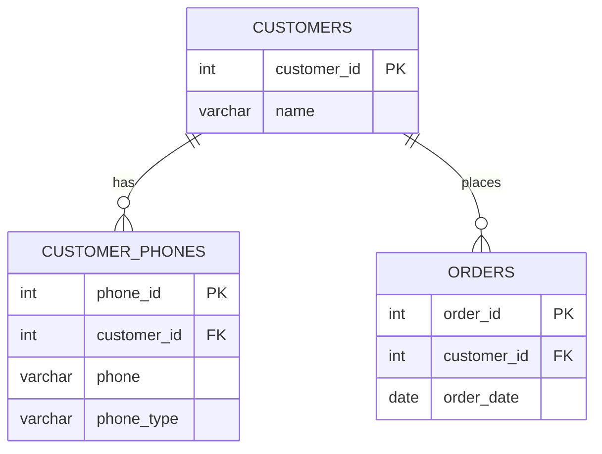
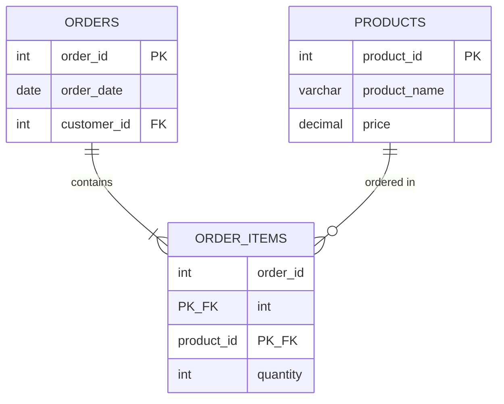
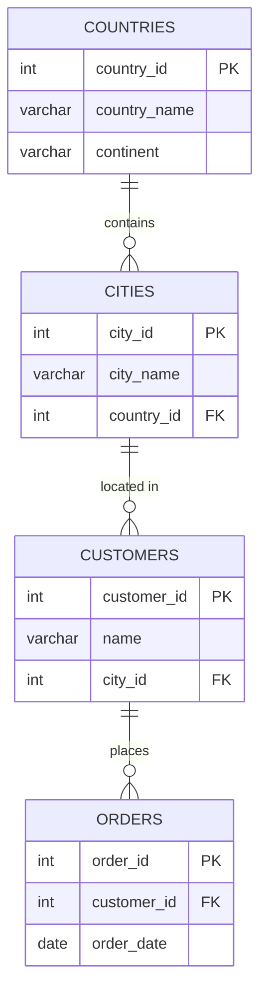
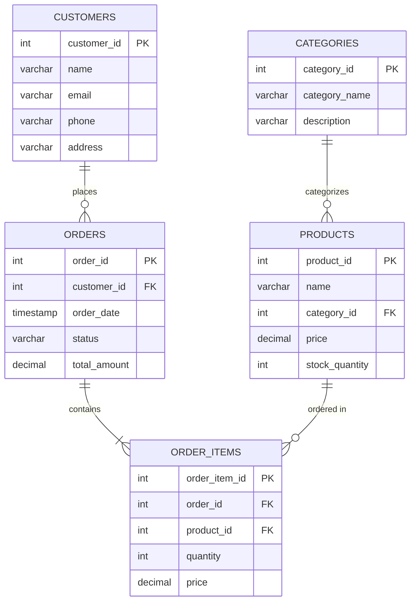
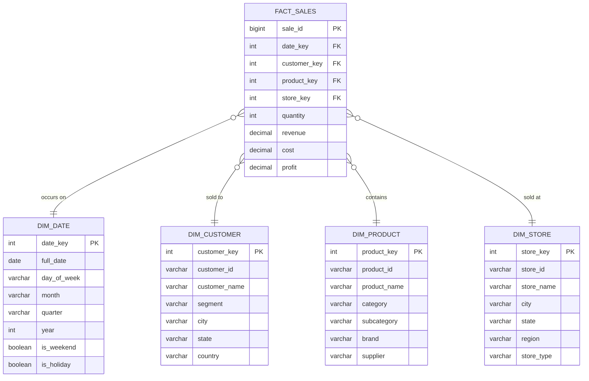
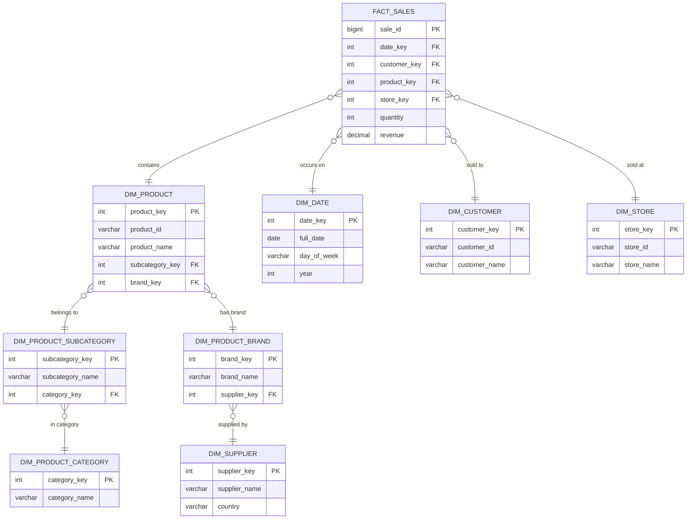
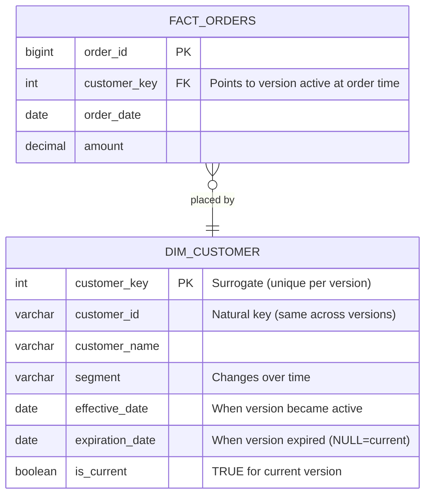
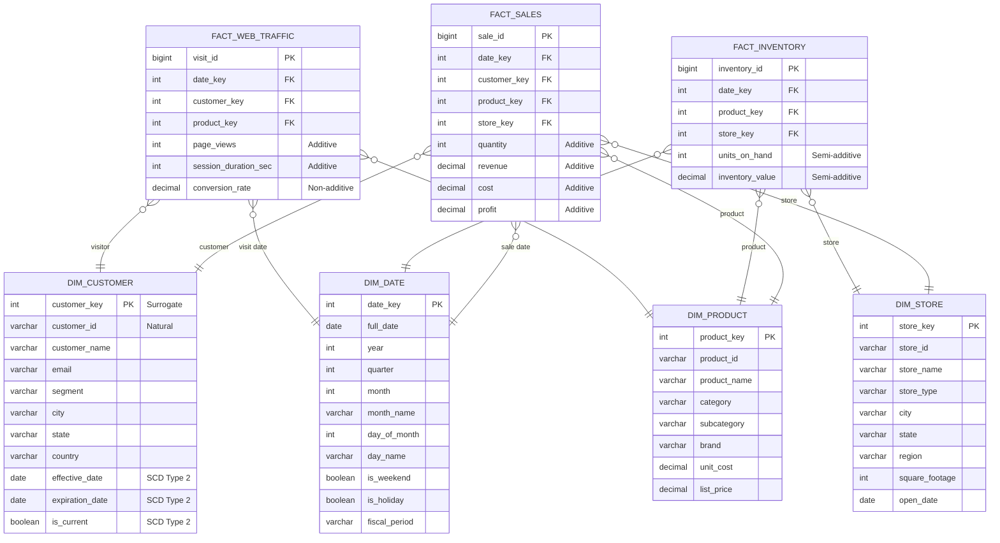

# Data Modeling & Table Design

## Overview

**Data modeling** is the process of designing how data is structured, stored, and related in a database. For data engineers, proper data modeling is critical for building scalable, performant, and maintainable data pipelines and analytics systems.

---

## Entity-Relationship Diagrams (ERDs)

ERDs visualize the structure and relationships between entities in a database. This section includes Mermaid diagrams that Obsidian renders automatically.

---

## Normalization vs Denormalization

### Normalization

**Purpose:** Eliminate data redundancy and improve data integrity.

**Characteristics:**
- Data is split into multiple related tables
- Reduces storage space
- Prevents update anomalies
- Requires JOINs to query data

**Normal Forms:**

#### 1NF (First Normal Form)
- Atomic values (no repeating groups)
- Each column contains single values

```sql
-- ❌ VIOLATES 1NF: Multiple phone numbers in one column
CREATE TABLE customers_bad (
    customer_id INT,
    name VARCHAR(100),
    phones VARCHAR(200)  -- "555-1234, 555-5678, 555-9999"
);

-- ✅ 1NF COMPLIANT: Atomic values
CREATE TABLE customers (
    customer_id INT,
    name VARCHAR(100)
);

CREATE TABLE customer_phones (
    customer_id INT,
    phone VARCHAR(20),
    phone_type VARCHAR(20)  -- 'mobile', 'home', 'work'
);
```

#### 2NF (Second Normal Form)
- Must be in 1NF
- No partial dependencies (all non-key columns depend on entire primary key)

```sql
-- ❌ VIOLATES 2NF: product_name depends only on product_id
CREATE TABLE order_items_bad (
    order_id INT,
    product_id INT,
    product_name VARCHAR(100),  -- Partial dependency
    quantity INT,
    PRIMARY KEY (order_id, product_id)
);

-- ✅ 2NF COMPLIANT: Separate tables
CREATE TABLE order_items (
    order_id INT,
    product_id INT,
    quantity INT,
    PRIMARY KEY (order_id, product_id)
);

CREATE TABLE products (
    product_id INT PRIMARY KEY,
    product_name VARCHAR(100)
);
```

#### 3NF (Third Normal Form)
- Must be in 2NF
- No transitive dependencies (non-key columns depend only on primary key)

```sql
-- ❌ VIOLATES 3NF: country depends on city
CREATE TABLE customers_bad (
    customer_id INT PRIMARY KEY,
    name VARCHAR(100),
    city VARCHAR(50),
    country VARCHAR(50)  -- Transitive dependency via city
);

-- ✅ 3NF COMPLIANT
CREATE TABLE customers (
    customer_id INT PRIMARY KEY,
    name VARCHAR(100),
    city_id INT
);

CREATE TABLE cities (
    city_id INT PRIMARY KEY,
    city_name VARCHAR(50),
    country VARCHAR(50)
);
```

#### Normalization Progression ERD

**❌ Unnormalized (Violates 1NF):**
```
┌─────────────────────────────────────────────────────────┐
│ CUSTOMER_ORDERS (Unnormalized)                         │
├─────────────────────────────────────────────────────────┤
│ customer_id | name    | phones              | orders   │
│ 1           | John    | 555-1234,555-5678   | O1,O2,O3 │
│             |         | (repeating group)   | (repeating group) │
└─────────────────────────────────────────────────────────┘
Problems: Cannot easily query individual phones or orders
```

**✅ 1NF (First Normal Form):**


**✅ 2NF (Second Normal Form) - Eliminates Partial Dependencies:**

*Product details removed from ORDER_ITEMS (no longer depend on partial key)*

**✅ 3NF (Third Normal Form) - Eliminates Transitive Dependencies:**

*Country no longer in CUSTOMERS (depends on city, not customer)*

### Denormalization

**Purpose:** Optimize read performance by reducing JOINs.

**Characteristics:**
- Data is duplicated across tables
- Faster queries (fewer JOINs)
- More storage space
- Potential for data inconsistency

**When to Denormalize:**
- Analytics/reporting systems (data warehouses)
- Read-heavy workloads
- Performance is critical
- Data changes infrequently

```sql
-- Denormalized fact table for analytics
CREATE TABLE sales_denormalized (
    sale_id BIGINT,
    sale_date DATE,
    customer_id INT,
    customer_name VARCHAR(100),      -- Denormalized
    customer_segment VARCHAR(20),    -- Denormalized
    product_id INT,
    product_name VARCHAR(100),       -- Denormalized
    product_category VARCHAR(50),    -- Denormalized
    quantity INT,
    unit_price DECIMAL(10,2),
    total_amount DECIMAL(10,2)
);

-- Fast queries without JOINs
SELECT
    customer_segment,
    product_category,
    SUM(total_amount) AS revenue
FROM sales_denormalized
WHERE sale_date >= '2024-01-01'
GROUP BY customer_segment, product_category;
```

---

## OLTP vs OLAP Systems

### OLTP (Online Transaction Processing)

**Characteristics:**
- Highly normalized (3NF)
- Many small, fast transactions
- INSERT/UPDATE/DELETE heavy
- Real-time operational data
- Row-oriented storage

**Examples:** Banking systems, e-commerce checkout, CRM

```sql
-- OLTP Design: Normalized
CREATE TABLE orders (
    order_id INT PRIMARY KEY,
    customer_id INT,
    order_date TIMESTAMP,
    status VARCHAR(20)
);

CREATE TABLE order_items (
    order_item_id INT PRIMARY KEY,
    order_id INT,
    product_id INT,
    quantity INT,
    price DECIMAL(10,2)
);

CREATE TABLE products (
    product_id INT PRIMARY KEY,
    name VARCHAR(100),
    category_id INT
);
```

#### OLTP ERD Example: E-commerce System



### OLAP (Online Analytical Processing)

**Characteristics:**
- Denormalized (star/snowflake schema)
- Complex analytical queries
- SELECT heavy
- Historical data
- Column-oriented storage

**Examples:** Data warehouses, BI systems, reporting

```sql
-- OLAP Design: Denormalized fact table
CREATE TABLE fact_sales (
    sale_id BIGINT PRIMARY KEY,
    date_key INT,              -- FK to dim_date
    customer_key INT,          -- FK to dim_customer
    product_key INT,           -- FK to dim_product
    store_key INT,             -- FK to dim_store
    quantity INT,
    revenue DECIMAL(10,2),
    cost DECIMAL(10,2),
    profit DECIMAL(10,2)
);
```

---

## Dimensional Modeling

### Star Schema

**Structure:** Central fact table surrounded by dimension tables.

**Characteristics:**
- Simple, intuitive design
- Fast query performance
- Denormalized dimensions
- Fewer JOINs

```sql
-- Fact Table (center of star)
CREATE TABLE fact_sales (
    sale_id BIGINT PRIMARY KEY,
    date_key INT,
    customer_key INT,
    product_key INT,
    store_key INT,
    quantity INT,
    revenue DECIMAL(10,2),
    cost DECIMAL(10,2),
    profit DECIMAL(10,2),
    FOREIGN KEY (date_key) REFERENCES dim_date(date_key),
    FOREIGN KEY (customer_key) REFERENCES dim_customer(customer_key),
    FOREIGN KEY (product_key) REFERENCES dim_product(product_key),
    FOREIGN KEY (store_key) REFERENCES dim_store(store_key)
);

-- Dimension Tables (points of star)
CREATE TABLE dim_date (
    date_key INT PRIMARY KEY,
    full_date DATE,
    day_of_week VARCHAR(10),
    month VARCHAR(10),
    quarter VARCHAR(2),
    year INT,
    is_weekend BOOLEAN,
    is_holiday BOOLEAN
);

CREATE TABLE dim_customer (
    customer_key INT PRIMARY KEY,
    customer_id VARCHAR(20),
    customer_name VARCHAR(100),
    segment VARCHAR(20),
    city VARCHAR(50),
    state VARCHAR(50),
    country VARCHAR(50),
    -- All customer attributes in one table (denormalized)
);

CREATE TABLE dim_product (
    product_key INT PRIMARY KEY,
    product_id VARCHAR(20),
    product_name VARCHAR(100),
    category VARCHAR(50),
    subcategory VARCHAR(50),
    brand VARCHAR(50),
    supplier VARCHAR(100)
    -- All product attributes in one table (denormalized)
);

CREATE TABLE dim_store (
    store_key INT PRIMARY KEY,
    store_id VARCHAR(20),
    store_name VARCHAR(100),
    city VARCHAR(50),
    state VARCHAR(50),
    region VARCHAR(50),
    store_type VARCHAR(20)
);
```

**Query Example:**
```sql
-- Simple query with star schema (only 4 JOINs)
SELECT
    d.year,
    d.quarter,
    c.segment,
    p.category,
    SUM(f.revenue) AS total_revenue,
    SUM(f.profit) AS total_profit
FROM fact_sales f
JOIN dim_date d ON f.date_key = d.date_key
JOIN dim_customer c ON f.customer_key = c.customer_key
JOIN dim_product p ON f.product_key = p.product_key
JOIN dim_store s ON f.store_key = s.store_key
WHERE d.year = 2024
GROUP BY d.year, d.quarter, c.segment, p.category;
```

#### Star Schema ERD



**Visual Representation:**

```
                    DIM_DATE
                       |
                       |
    DIM_CUSTOMER ---- FACT_SALES ---- DIM_PRODUCT
                       |
                       |
                    DIM_STORE

         ⭐ Star Schema: Fact table at center,
            dimensions radiate outward
```

### Snowflake Schema

**Structure:** Star schema with normalized dimension tables.

**Characteristics:**
- Dimensions are normalized into sub-dimensions
- Saves storage space
- More complex queries (more JOINs)
- Better for large, complex dimensions

```sql
-- Fact Table (same as star schema)
CREATE TABLE fact_sales (
    sale_id BIGINT PRIMARY KEY,
    date_key INT,
    customer_key INT,
    product_key INT,
    store_key INT,
    quantity INT,
    revenue DECIMAL(10,2)
);

-- Normalized Product Dimension
CREATE TABLE dim_product (
    product_key INT PRIMARY KEY,
    product_id VARCHAR(20),
    product_name VARCHAR(100),
    subcategory_key INT,  -- Normalized
    brand_key INT         -- Normalized
);

CREATE TABLE dim_product_subcategory (
    subcategory_key INT PRIMARY KEY,
    subcategory_name VARCHAR(50),
    category_key INT  -- Further normalized
);

CREATE TABLE dim_product_category (
    category_key INT PRIMARY KEY,
    category_name VARCHAR(50)
);

CREATE TABLE dim_product_brand (
    brand_key INT PRIMARY KEY,
    brand_name VARCHAR(50),
    supplier_key INT
);

CREATE TABLE dim_supplier (
    supplier_key INT PRIMARY KEY,
    supplier_name VARCHAR(100),
    country VARCHAR(50)
);
```

**Query Example:**
```sql
-- More JOINs required with snowflake schema
SELECT
    pc.category_name,
    psc.subcategory_name,
    pb.brand_name,
    SUM(f.revenue) AS total_revenue
FROM fact_sales f
JOIN dim_product p ON f.product_key = p.product_key
JOIN dim_product_subcategory psc ON p.subcategory_key = psc.subcategory_key
JOIN dim_product_category pc ON psc.category_key = pc.category_key
JOIN dim_product_brand pb ON p.brand_key = pb.brand_key
GROUP BY pc.category_name, psc.subcategory_name, pb.brand_name;
```

#### Snowflake Schema ERD



**Visual Representation:**

```
                         DIM_DATE
                            |
                            |
       DIM_CUSTOMER ---- FACT_SALES ---- DIM_PRODUCT ---- DIM_PRODUCT_SUBCATEGORY ---- DIM_PRODUCT_CATEGORY
                            |                  |
                            |                  |
                         DIM_STORE      DIM_PRODUCT_BRAND ---- DIM_SUPPLIER

         ❄️ Snowflake Schema: Normalized dimensions
            branch out from fact table
```

### Star vs Snowflake Comparison

| Aspect | Star Schema | Snowflake Schema |
|--------|-------------|------------------|
| **Complexity** | Simple | Complex |
| **Query Performance** | Faster (fewer JOINs) | Slower (more JOINs) |
| **Storage** | More (denormalized) | Less (normalized) |
| **Maintenance** | Easier | Harder |
| **Data Integrity** | Lower | Higher |
| **Use Case** | Most data warehouses | Very large dimensions |

---

## Fact and Dimension Tables

### Fact Tables

**Purpose:** Store measurable business events (transactions, measurements).

**Characteristics:**
- Contains foreign keys to dimension tables
- Contains numeric measures (facts)
- Very large (millions to billions of rows)
- Narrow (fewer columns, mostly numeric)

**Types of Facts:**

#### 1. Additive Facts
Can be summed across any dimension.

```sql
CREATE TABLE fact_sales (
    sale_id BIGINT,
    date_key INT,
    customer_key INT,
    product_key INT,
    quantity INT,           -- Additive
    revenue DECIMAL(10,2),  -- Additive
    cost DECIMAL(10,2),     -- Additive
    profit DECIMAL(10,2)    -- Additive
);

-- Valid aggregation across any dimension
SELECT SUM(revenue) FROM fact_sales;  -- Total revenue
SELECT customer_key, SUM(revenue) FROM fact_sales GROUP BY customer_key;
SELECT product_key, SUM(revenue) FROM fact_sales GROUP BY product_key;
```

#### 2. Semi-Additive Facts
Can be summed across some dimensions but not all.

```sql
CREATE TABLE fact_account_balance (
    snapshot_date DATE,
    account_key INT,
    balance DECIMAL(15,2)  -- Semi-additive (don't sum across time!)
);

-- ✅ VALID: Sum across accounts for a given day
SELECT snapshot_date, SUM(balance) AS total_balance
FROM fact_account_balance
WHERE snapshot_date = '2024-01-31'
GROUP BY snapshot_date;

-- ❌ INVALID: Summing across time double-counts
SELECT SUM(balance) FROM fact_account_balance;  -- Wrong!

-- ✅ CORRECT: Average or latest value across time
SELECT account_key, AVG(balance) AS avg_balance
FROM fact_account_balance
GROUP BY account_key;
```

#### 3. Non-Additive Facts
Cannot be summed (ratios, percentages).

```sql
CREATE TABLE fact_metrics (
    date_key INT,
    product_key INT,
    price DECIMAL(10,2),           -- Non-additive
    margin_percentage DECIMAL(5,2), -- Non-additive
    conversion_rate DECIMAL(5,4)   -- Non-additive
);

-- ❌ INVALID: Cannot sum percentages
SELECT SUM(margin_percentage) FROM fact_metrics;  -- Meaningless!

-- ✅ CORRECT: Calculate weighted average
SELECT
    AVG(margin_percentage) AS avg_margin,
    AVG(conversion_rate) AS avg_conversion
FROM fact_metrics;
```

### Dimension Tables

**Purpose:** Provide descriptive context for facts (who, what, where, when, why).

**Characteristics:**
- Contain descriptive attributes
- Relatively small (thousands to millions of rows)
- Wide (many columns)
- Change infrequently

**Common Dimensions:**

```sql
-- Date Dimension (most common)
CREATE TABLE dim_date (
    date_key INT PRIMARY KEY,
    full_date DATE,
    day_of_week VARCHAR(10),
    day_name VARCHAR(10),
    day_of_month INT,
    day_of_year INT,
    week_of_year INT,
    month INT,
    month_name VARCHAR(10),
    quarter INT,
    year INT,
    is_weekend BOOLEAN,
    is_holiday BOOLEAN,
    holiday_name VARCHAR(50),
    fiscal_year INT,
    fiscal_quarter INT
);

-- Customer Dimension
CREATE TABLE dim_customer (
    customer_key INT PRIMARY KEY,         -- Surrogate key
    customer_id VARCHAR(20),              -- Natural key
    customer_name VARCHAR(100),
    email VARCHAR(100),
    phone VARCHAR(20),
    birth_date DATE,
    age_group VARCHAR(20),
    gender VARCHAR(10),
    address VARCHAR(200),
    city VARCHAR(50),
    state VARCHAR(50),
    postal_code VARCHAR(20),
    country VARCHAR(50),
    customer_segment VARCHAR(20),
    lifetime_value_tier VARCHAR(20),
    registration_date DATE,
    effective_date DATE,                  -- For SCD Type 2
    expiration_date DATE,                 -- For SCD Type 2
    is_current BOOLEAN                    -- For SCD Type 2
);

-- Product Dimension
CREATE TABLE dim_product (
    product_key INT PRIMARY KEY,
    product_id VARCHAR(20),
    product_name VARCHAR(100),
    description TEXT,
    category VARCHAR(50),
    subcategory VARCHAR(50),
    brand VARCHAR(50),
    supplier VARCHAR(100),
    unit_cost DECIMAL(10,2),
    list_price DECIMAL(10,2),
    size VARCHAR(20),
    color VARCHAR(20),
    weight DECIMAL(10,2),
    is_active BOOLEAN
);
```

---

## Slowly Changing Dimensions (SCD)

Strategies for handling dimension attributes that change over time.

### Type 0: Retain Original

**Strategy:** Never update, keep original values forever.

```sql
CREATE TABLE dim_customer (
    customer_key INT PRIMARY KEY,
    customer_id VARCHAR(20),
    original_segment VARCHAR(20),  -- Never changes
    registration_date DATE         -- Never changes
);

-- No updates allowed on these columns
```

**Use Case:** Historical attributes that should never change (e.g., birthdate, registration date).

### Type 1: Overwrite

**Strategy:** Overwrite old value with new value (no history).

```sql
CREATE TABLE dim_customer (
    customer_key INT PRIMARY KEY,
    customer_id VARCHAR(20),
    email VARCHAR(100),
    phone VARCHAR(20),
    address VARCHAR(200)
);

-- Update overwrites old value
UPDATE dim_customer
SET phone = '555-9999'
WHERE customer_id = 'C001';

-- Old phone number is lost
```

**Use Case:** Correcting errors, attributes where history doesn't matter (e.g., fixing typos).

**Pros:**
- Simple to implement
- No additional storage
- Easy queries

**Cons:**
- Lose historical data
- Can't analyze trends

### Type 2: Add New Row (Most Common)

**Strategy:** Create new row with new values, keep old row as history.

```sql
CREATE TABLE dim_customer (
    customer_key INT PRIMARY KEY,        -- Surrogate key (unique for each version)
    customer_id VARCHAR(20),             -- Natural key (same across versions)
    customer_name VARCHAR(100),
    segment VARCHAR(20),
    effective_date DATE,                 -- When this version became active
    expiration_date DATE,                -- When this version expired (NULL = current)
    is_current BOOLEAN                   -- TRUE for current version
);

-- Initial insert
INSERT INTO dim_customer VALUES
(1, 'C001', 'John Doe', 'Bronze', '2023-01-01', NULL, TRUE);

-- Customer upgraded to Silver segment
-- 1. Close old row
UPDATE dim_customer
SET expiration_date = '2024-06-30', is_current = FALSE
WHERE customer_id = 'C001' AND is_current = TRUE;

-- 2. Insert new row
INSERT INTO dim_customer VALUES
(2, 'C001', 'John Doe', 'Silver', '2024-07-01', NULL, TRUE);

-- Query for current state
SELECT * FROM dim_customer WHERE is_current = TRUE;

-- Query for historical state at specific date
SELECT * FROM dim_customer
WHERE customer_id = 'C001'
  AND '2024-01-15' BETWEEN effective_date AND COALESCE(expiration_date, '9999-12-31');
```

**Pros:**
- Full history preserved
- Can analyze trends over time
- Point-in-time accuracy

**Cons:**
- More storage space
- More complex queries
- Dimension table grows larger

#### SCD Type 2 Visualization



**SCD Type 2 Example Data:**

```
customer_key | customer_id | name      | segment | effective_date | expiration_date | is_current
-------------|-------------|-----------|---------|----------------|-----------------|------------
1            | C001        | John Doe  | Bronze  | 2023-01-01     | 2024-06-30      | FALSE
2            | C001        | John Doe  | Silver  | 2024-07-01     | NULL            | TRUE
3            | C002        | Jane Doe  | Gold    | 2023-05-01     | NULL            | TRUE

Result: C001 has 2 versions (history preserved), C002 has 1 version (no changes yet)
```

### Type 3: Add New Column

**Strategy:** Add columns to track both old and new values (limited history).

```sql
CREATE TABLE dim_customer (
    customer_key INT PRIMARY KEY,
    customer_id VARCHAR(20),
    customer_name VARCHAR(100),
    current_segment VARCHAR(20),
    previous_segment VARCHAR(20),
    segment_change_date DATE
);

-- Initial state
INSERT INTO dim_customer VALUES
(1, 'C001', 'John Doe', 'Bronze', NULL, NULL);

-- Customer upgraded
UPDATE dim_customer
SET
    previous_segment = current_segment,
    current_segment = 'Silver',
    segment_change_date = '2024-07-01'
WHERE customer_id = 'C001';

-- Can track one level of history
SELECT
    customer_name,
    previous_segment,
    current_segment,
    segment_change_date
FROM dim_customer;
```

**Pros:**
- Simple queries (no additional JOINs)
- Track one level of change
- Fixed table size

**Cons:**
- Limited history (only previous value)
- Can't analyze long-term trends
- Schema changes for each tracked attribute

### Type 4: Add History Table

**Strategy:** Current values in dimension table, full history in separate table.

```sql
-- Current dimension table
CREATE TABLE dim_customer (
    customer_key INT PRIMARY KEY,
    customer_id VARCHAR(20),
    customer_name VARCHAR(100),
    segment VARCHAR(20),
    email VARCHAR(100)
);

-- Separate history table
CREATE TABLE dim_customer_history (
    history_key INT PRIMARY KEY,
    customer_key INT,
    customer_id VARCHAR(20),
    customer_name VARCHAR(100),
    segment VARCHAR(20),
    email VARCHAR(100),
    effective_date DATE,
    expiration_date DATE
);

-- Current queries use dim_customer (simple, fast)
SELECT * FROM dim_customer WHERE customer_id = 'C001';

-- Historical queries use dim_customer_history
SELECT * FROM dim_customer_history
WHERE customer_id = 'C001'
  AND '2024-01-15' BETWEEN effective_date AND expiration_date;
```

**Pros:**
- Current queries are simple and fast
- Full history available when needed
- Separates operational from analytical concerns

**Cons:**
- More complex ETL (maintain two tables)
- Risk of inconsistency between tables

### Type 6: Hybrid (1+2+3)

**Strategy:** Combine Types 1, 2, and 3 for different attributes.

```sql
CREATE TABLE dim_customer (
    customer_key INT PRIMARY KEY,        -- Type 2: Surrogate key
    customer_id VARCHAR(20),             -- Natural key
    customer_name VARCHAR(100),          -- Type 1: Overwrite
    current_segment VARCHAR(20),         -- Type 3: Current value
    historical_segment VARCHAR(20),      -- Type 2: Historical value
    email VARCHAR(100),                  -- Type 1: Overwrite
    effective_date DATE,                 -- Type 2
    expiration_date DATE,                -- Type 2
    is_current BOOLEAN                   -- Type 2
);
```

**Use Case:** When different attributes require different SCD strategies.

---

## Surrogate Keys vs Natural Keys

### Natural Key

**Definition:** A key that has business meaning (e.g., customer_id, product_code).

```sql
CREATE TABLE customers (
    customer_id VARCHAR(20) PRIMARY KEY,  -- Natural key
    customer_name VARCHAR(100)
);
```

**Pros:**
- Meaningful to business users
- Already exists in source systems

**Cons:**
- Can change (e.g., customer ID format changes)
- May be compound (multiple columns)
- Can be long/inefficient (strings vs integers)

### Surrogate Key

**Definition:** An artificial key with no business meaning (usually auto-incrementing integer).

```sql
CREATE TABLE dim_customer (
    customer_key INT PRIMARY KEY AUTO_INCREMENT,  -- Surrogate key
    customer_id VARCHAR(20),                      -- Natural key preserved
    customer_name VARCHAR(100)
);
```

**Pros:**
- Never changes (stable for SCD Type 2)
- Efficient (small integer for JOINs)
- Consistent across all dimension tables
- Simplifies SCD implementation

**Cons:**
- No business meaning
- Requires lookup to find natural key

### Best Practice for Data Warehouses

**Use both:**
- Surrogate key as primary key
- Natural key preserved as a column

```sql
CREATE TABLE dim_customer (
    customer_key INT PRIMARY KEY,              -- Surrogate key for internal use
    customer_id VARCHAR(20) NOT NULL,          -- Natural key from source
    customer_name VARCHAR(100),
    effective_date DATE,
    expiration_date DATE,
    is_current BOOLEAN,
    UNIQUE (customer_id, effective_date)       -- Ensure uniqueness per version
);

-- Index on natural key for lookups
CREATE INDEX idx_customer_natural_key ON dim_customer(customer_id);
```

---

## Partitioning Strategies

### What is Partitioning?

Dividing large tables into smaller, more manageable pieces.

### Range Partitioning (Most Common)

Partition by value ranges (typically dates).

```sql
-- PostgreSQL syntax
CREATE TABLE fact_sales (
    sale_id BIGINT,
    sale_date DATE,
    customer_id INT,
    amount DECIMAL(10,2)
) PARTITION BY RANGE (sale_date);

-- Create partitions for each month
CREATE TABLE fact_sales_2024_01 PARTITION OF fact_sales
    FOR VALUES FROM ('2024-01-01') TO ('2024-02-01');

CREATE TABLE fact_sales_2024_02 PARTITION OF fact_sales
    FOR VALUES FROM ('2024-02-01') TO ('2024-03-01');

CREATE TABLE fact_sales_2024_03 PARTITION OF fact_sales
    FOR VALUES FROM ('2024-03-01') TO ('2024-04-01');
```

**Benefits:**
- Faster queries (partition pruning)
- Easier maintenance (drop old partitions)
- Parallel query execution
- Easier archival

### List Partitioning

Partition by specific values.

```sql
CREATE TABLE sales_by_region (
    sale_id BIGINT,
    region VARCHAR(20),
    amount DECIMAL(10,2)
) PARTITION BY LIST (region);

CREATE TABLE sales_north_america PARTITION OF sales_by_region
    FOR VALUES IN ('USA', 'Canada', 'Mexico');

CREATE TABLE sales_europe PARTITION OF sales_by_region
    FOR VALUES IN ('UK', 'Germany', 'France');
```

### Hash Partitioning

Partition by hash function (even distribution).

```sql
CREATE TABLE orders (
    order_id BIGINT,
    customer_id INT,
    amount DECIMAL(10,2)
) PARTITION BY HASH (customer_id);

-- Create 4 partitions
CREATE TABLE orders_p0 PARTITION OF orders FOR VALUES WITH (MODULUS 4, REMAINDER 0);
CREATE TABLE orders_p1 PARTITION OF orders FOR VALUES WITH (MODULUS 4, REMAINDER 1);
CREATE TABLE orders_p2 PARTITION OF orders FOR VALUES WITH (MODULUS 4, REMAINDER 2);
CREATE TABLE orders_p3 PARTITION OF orders FOR VALUES WITH (MODULUS 4, REMAINDER 3);
```

---

## Complete Data Warehouse ERD Example

This comprehensive ERD shows a typical data warehouse schema with multiple fact tables and shared dimensions:



**Key Design Elements:**

1. **Multiple Fact Tables** - Different business processes (sales, inventory, web traffic)
2. **Shared Dimensions** - Same dimension tables used across facts (conformed dimensions)
3. **Different Fact Types**:
   - `FACT_SALES`: Transactional (additive facts)
   - `FACT_INVENTORY`: Snapshot (semi-additive facts)
   - `FACT_WEB_TRAFFIC`: Event (mixed fact types)
4. **SCD Type 2** - Customer dimension tracks historical changes
5. **Surrogate Keys** - All dimensions use integer surrogate keys

**Query Example Across Multiple Facts:**

```sql
-- Customer lifetime value with inventory levels
SELECT
    c.customer_name,
    c.segment,
    SUM(s.revenue) AS total_revenue,
    COUNT(DISTINCT s.sale_id) AS purchase_count,
    AVG(i.units_on_hand) AS avg_inventory_level,
    SUM(w.page_views) AS total_page_views
FROM dim_customer c
LEFT JOIN fact_sales s ON c.customer_key = s.customer_key
LEFT JOIN fact_inventory i ON s.product_key = i.product_key AND s.date_key = i.date_key
LEFT JOIN fact_web_traffic w ON c.customer_key = w.customer_key
WHERE c.is_current = TRUE
  AND s.date_key >= 20240101
GROUP BY c.customer_name, c.segment;
```

---

## Best Practices for Data Modeling

### 1. Choose the Right Model for Your Use Case

- **OLTP:** Use normalized design (3NF)
- **OLAP:** Use dimensional design (star/snowflake)
- **Hybrid:** Separate OLTP and OLAP systems

### 2. Use Appropriate Keys

- **Surrogate keys** for dimension tables
- Preserve **natural keys** for reference
- **Composite keys** for fact tables (if no surrogate)

### 3. Implement SCD Appropriately

- **Type 1:** For corrections, non-critical attributes
- **Type 2:** For tracking history (most common in DW)
- **Type 3:** For simple before/after comparisons

### 4. Partition Large Tables

- Partition fact tables by date
- Improves query performance
- Simplifies data archival

### 5. Document Your Model

```sql
-- Add comments to tables and columns
COMMENT ON TABLE fact_sales IS 'Daily sales transactions at order line item level';
COMMENT ON COLUMN fact_sales.revenue IS 'Revenue in USD, calculated as quantity * unit_price';
```

### 6. Consider Data Retention

```sql
-- Implement retention policies
-- Delete partitions older than 2 years
DROP TABLE IF EXISTS fact_sales_2022_01;
DROP TABLE IF EXISTS fact_sales_2022_02;
```

---

## Related Concepts

- [[SQL Basics - Quick Reference]] - Foundation SQL
- [[SQL Indexes - Performance Optimization]] - Indexing strategies
- [[Window Functions - Advanced SQL Analytics]] - Analytical queries
- [[Dimensional Data Modeling - Day 1]] - Additional modeling concepts

---

## Key Takeaways

1. **Normalization** reduces redundancy, **denormalization** improves query performance
2. **OLTP** systems use normalized models, **OLAP** systems use dimensional models
3. **Star schema** is simpler and faster, **snowflake schema** saves space
4. **Fact tables** contain measurable events, **dimension tables** provide context
5. **SCD Type 2** is most common for tracking dimensional changes in data warehouses
6. **Surrogate keys** are essential for dimensional modeling
7. **Partitioning** improves performance and maintenance for large tables
8. Choose modeling strategy based on workload: transactional vs analytical
